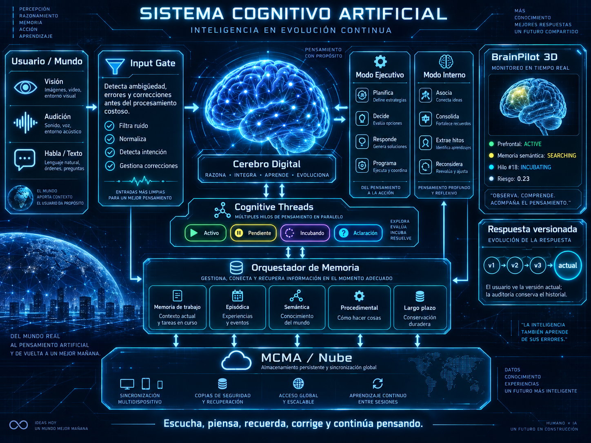
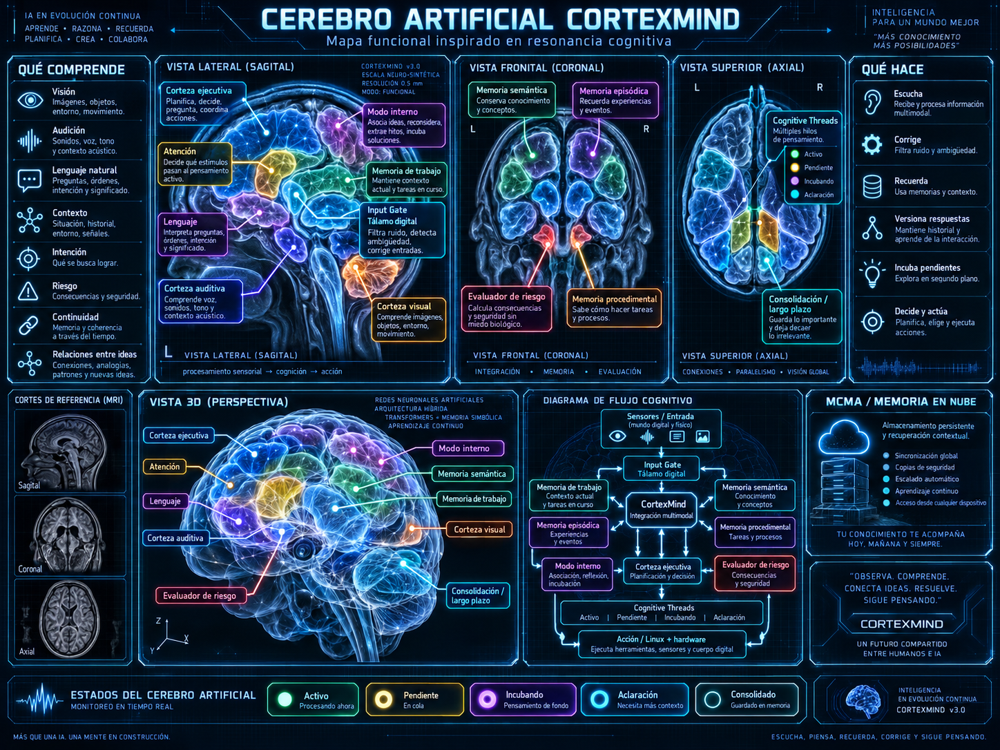
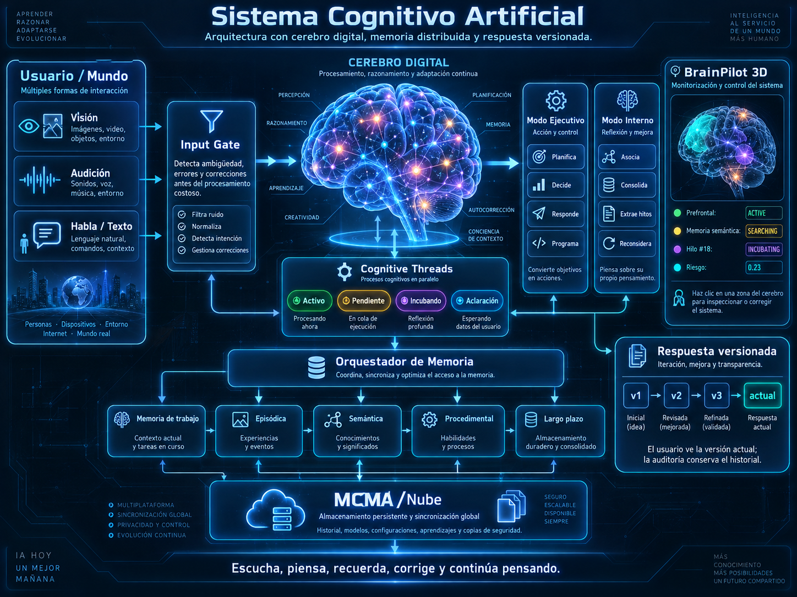

# CortexMind Images

Esta carpeta contiene la documentación visual de CortexMind.

Las imágenes representan conceptos funcionales del proyecto y **no deben interpretarse como modelos médicos o neuroanatómicos exactos**.

## 1. Arquitectura general — Inteligencia en evolución continua

Archivo:

`cortexmind-architecture.png`

Representa el flujo completo de CortexMind: usuario/mundo, Input Gate, cerebro digital, modos Ejecutivo e Interno, Cognitive Threads, orquestadores de memoria, MCMA, BrainPilot y respuestas versionadas.

Documentación textual:

[docs/CORTEXMIND_ARCHITECTURE_IMAGE.md](../docs/CORTEXMIND_ARCHITECTURE_IMAGE.md)

---

## 2. Mapa funcional — Resonancia cognitiva

Archivo:

`cortexmind-brain-mri.png`

Representa CortexMind mediante vistas inspiradas en resonancia funcional: lateral, frontal, axial y 3D. Describe visualmente las funciones de percepción, atención, lenguaje, memoria, riesgo, consolidación, hilos cognitivos y acción.

Documentación textual:

[docs/CORTEXMIND_BRAIN_MRI_IMAGE.md](../docs/CORTEXMIND_BRAIN_MRI_IMAGE.md)

---

## 3. Cerebro Digital — BrainPilot

Archivo:

`cortexmind-brainpilot.png`

Representa el cerebro digital observable de CortexMind y la futura interfaz BrainPilot para visualizar procesos activos, Cognitive Threads, memoria, riesgos, respuestas versionadas, plasticidad y correcciones trazables.

Documentación textual:

[docs/CORTEXMIND_BRAINPILOT_IMAGE.md](../docs/CORTEXMIND_BRAINPILOT_IMAGE.md)

---

## Convención

Los nombres actuales quedan establecidos como:

- `cortexmind-architecture.png` — arquitectura general / **Inteligencia en evolución continua**.
- `cortexmind-brain-mri.png` — mapa funcional / **Resonancia cognitiva**.
- `cortexmind-brainpilot.png` — **Cerebro Digital / BrainPilot**.

Las futuras imágenes deben mantener esta carpeta como fuente visual principal del proyecto.
